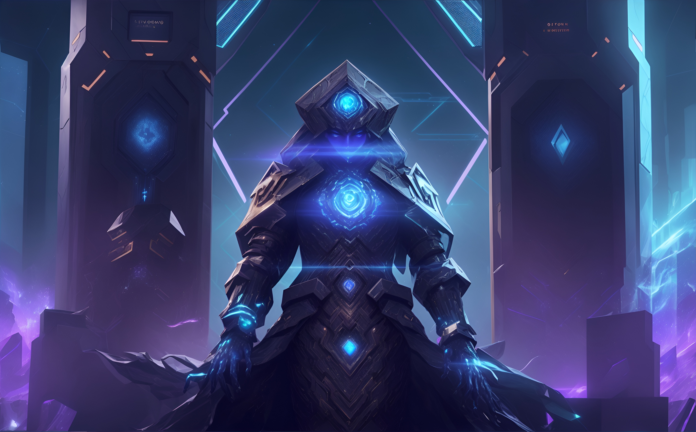
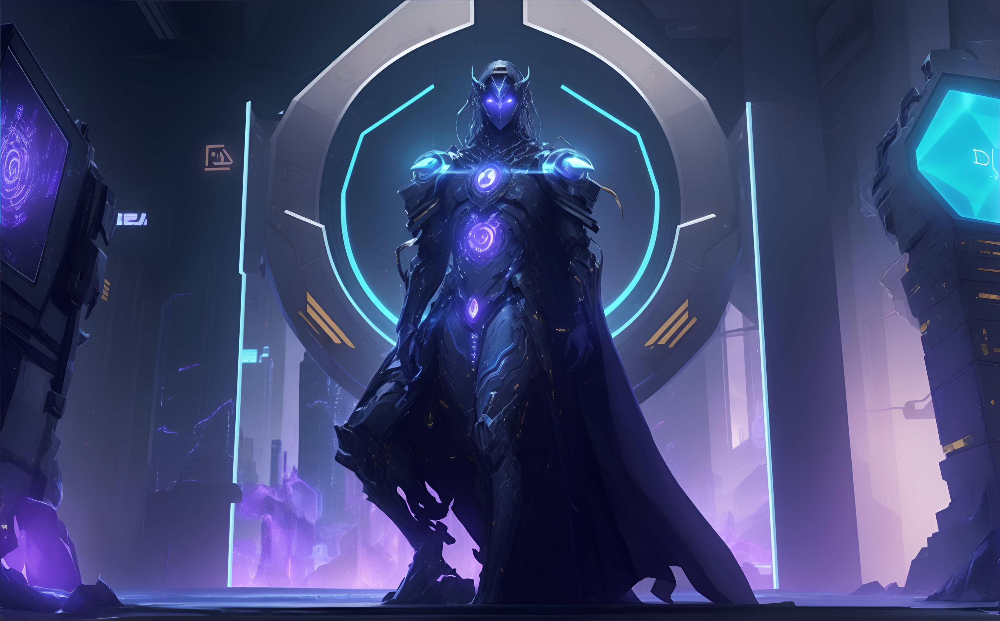

---

# `CryptoChronos`: Unleashing Temporal Power in Decentralized Finance
Melding the raw essence of time with the unparalleled potential of blockchain technology, `CryptoChronos` stands as a sentinel, guarding assets in the chaotic digital realm of DeFi.

## 🚀 Unveiling the ChronoGuard: The `CryptoChronos` Protocol 🌐

### 🌟 Origins
In the neon-lit streets of Cybertropolis, where quantum networks intersect with holographic bazaars, a new kind of revolution was brewing. The Syndicate, a conglomerate of crypto-anarchists and quantum programmers, had a vision - to redefine financial security in the digital age.

### 🎯 Quantum Mandate
In a world where every byte and qubit is a battlefield, the need for an impregnable financial bastion was paramount. The Syndicate envisioned the `CryptoChronos` - a temporal vault intertwining the essence of time with cryptographic security. Assets, once deposited, would meld with the temporal flux, accessible only when the sands of time deemed it right. ⏳💎

### 📜 The Quantum Ledger
The `CryptoChronos` wasn't just a smart contract; it was a symphony of quantum code. It leveraged time-locked algorithms, ensuring assets remained secure, phasing in and out of the temporal matrix, governed by user-defined time constraints. 🌀🔒

### 🛠️ The Forge
In the virtual forges of Cybertropolis, quantum qubits danced with Solidity strings. The Syndicate, with unmatched prowess, sculpted the `CryptoChronos`, ensuring every function, from deposits to the unique deadman switch, was quantum-secure and user-centric. 🌌🛡️

### 🚀 Ascension
With the final qubit in place, the `CryptoChronos` was unleashed onto the Ethereum Metanet. Its presence was not just an addition; it was a paradigm shift in DeFi. 🌠🚀

### 🧪 Quantum Trials
The Metanet is unforgiving. Recognizing this, The Syndicate initiated a series of quantum entanglement tests, pushing the `CryptoChronos` to its limits, ensuring that whether in this timeline or another, user assets remained secure. 🧬🔍

### 🎁 Quantum Revelation
From the digital alleys of Cybertropolis to the vast Metanet, the `CryptoChronos` was hailed as a marvel, a testament to what's achievable when time, code, and passion converge. 🌌🎉

### 🌈 The Nexus Awaits
For The Syndicate, `CryptoChronos` was merely the dawn. Ahead lay endless timelines, infinite possibilities, and the promise of a secure, decentralized financial cosmos. 🪐🌌

Step into the future with `CryptoChronos`. Embark on a journey where finance, time, and quantum realms coalesce. Because here, we're not just coding; we're crafting the very fabric of the financial multiverse. ⚛️🌟

---
