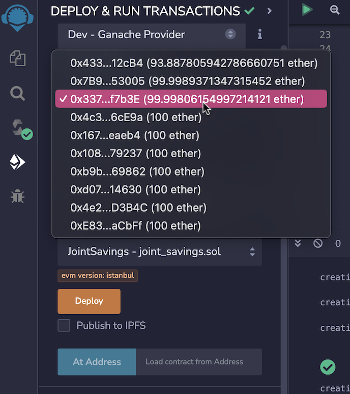
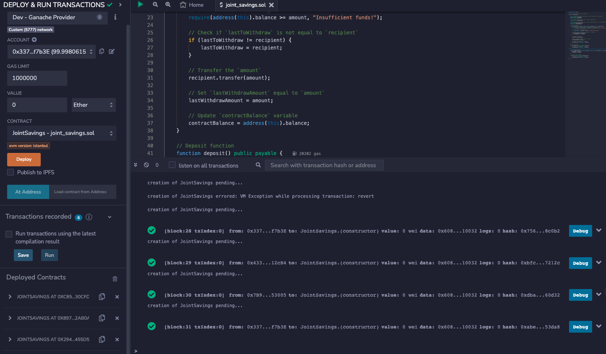
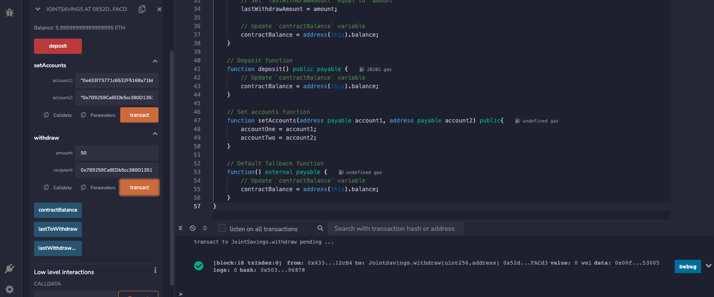
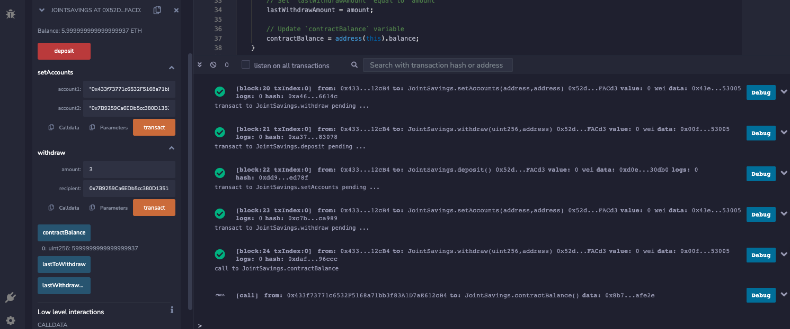
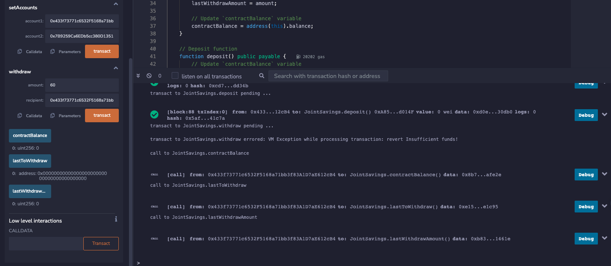

---

# `JointSavings`: A Deep Dive Analysis

The `JointSavings` smart contract is a blockchain-based solution designed to manage a shared savings account between two users. This contract allows two users to deposit funds, track the last withdrawal, and ensure that only registered account owners can withdraw funds.

## Key Components:

### Variables:
1. **accountOne & accountTwo**:
   - Type: `address payable`
   - Purpose: These represent the Ethereum addresses of the two account holders.

2. **lastToWithdraw**:
   - Type: `address public`
   - Purpose: Keeps track of the Ethereum address of the last account that performed a withdrawal.

3. **lastWithdrawAmount**:
   - Type: `uint public`
   - Purpose: Tracks the amount withdrawn during the last transaction.

4. **contractBalance**:
   - Type: `uint public`
   - Purpose: Maintains a record of the current balance of the smart contract.

### Functions:

1. **withdraw**:
   - Input: `uint amount`, `address payable recipient`
   - Purpose: Allows a registered account holder to withdraw a specified amount.
   - Key Features:
     - Verifies the recipient is one of the two registered accounts.
     - Checks for sufficient funds before allowing withdrawal.
     - Updates the last account to withdraw and the amount withdrawn.

2. **deposit**:
   - Input: `None` (However, it accepts Ether during the transaction)
   - Purpose: Allows anyone to deposit funds into the contract.
   - Key Features:
     - Updates the contract's balance after deposit.

3. **setAccounts**:
   - Input: `address payable account1`, `address payable account2`
   - Purpose: Initializes the two account holders' Ethereum addresses.
   - Key Features:
     - Assigns the input addresses to `accountOne` and `accountTwo`.

4. **Fallback function**:
   - Input: `None`
   - Purpose: A default function that gets executed when the contract receives Ether without any function call.
   - Key Features:
     - Updates the contract's balance when Ether is sent to the contract address.

## Proof of Work:

### Step 3: Interact with Your Deployed Smart Contract

1. **Set Accounts**:
   - Use the `setAccounts` function to set the Ethereum addresses of the two account holders.
   - **Proof**: Capture a screenshot of the transaction confirmation after execution.

2. **Test the Deposit Function**:
   - Deposit funds into the contract multiple times.
   - **Proof**: After each deposit, capture a screenshot showcasing the transaction details.
     Deposits
     

3. **Test the Withdraw Function**:
   - Initiate withdrawals from the contract.
   - **Proof**: After each withdrawal, capture a screenshot of the transaction. Additionally, showcase the outputs from the `lastToWithdraw` and `lastWithdrawAmount` functions.
   - 
     Withdraws 1-3 

     LastToWithdraw_Output/LastWithdrawAmount_Output
     

---

This comprehensive analysis breaks down the core components of the `JointSavings` smart contract. Through understanding its variables and functions, users can confidently interact with it. The proof of work section serves as evidence of the contract's reliability and functionality in a real-world Ethereum environment.
